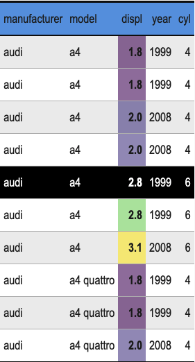

## Creating Dummy Text

First, I created some dummy text via

```{r, eval = FALSE, include = TRUE, message = FALSE, warning = FALSE}
library(tidyverse)
library(stringi)
set.seed(123)
stri_rand_lipsum(1)
```

## Dealing With Formatting

The output from thos functions can be easily formated like so:

**Lorem ipsum dolor sit amet, sollicitudin duis maecenas habitasse ultrices aenean tempus.** Volutpat id, non natoque ad, commodo suscipit sed risus, facilisis mauris aliquam, a. **Non leo leo, sapien non eu a quam.** Nunc vivamus in, `purus ultricies` ac suspendisse at. Eu quisque fames sapien consequat et nisl nunc, `viverra est mattis` mattis posuere. [Link](Purus quisque auctor aenean sed risus mauris ante nisi). Ligula ac vitae lacinia. Magna aliquet et mi cubilia per. Hendrerit amet eu ullamcorper turpis ultrices aliquam.^[This is an amazing footnote containing another [Link](Link)]

Also, one can transform the text into lists sentence by sentence

* Lorem ipsum dolor sit amet, sollicitudin duis maecenas habitasse ultrices aenean tempus.
* Volutpat id, non natoque ad, commodo suscipit sed risus, facilisis mauris aliquam, a.
* Non leo leo, sapien non eu a quam.
* Nunc vivamus in, purus ultricies ac suspendisse at.
* Eu quisque fames sapien consequat et nisl nunc, viverra est mattis mattis posuere.
* Purus quisque auctor aenean sed risus mauris ante nisi.
* Ligula ac vitae lacinia. Magna aliquet et mi cubilia per.
* Hendrerit amet eu ullamcorper turpis ultrices aliquam.
1. Lorem ipsum dolor sit amet, sollicitudin duis maecenas habitasse ultrices aenean tempus.
1. Volutpat id, non natoque ad, commodo suscipit sed risus, facilisis mauris aliquam, a.
1. Non leo leo, sapien non eu a quam.
1. Nunc vivamus in, purus ultricies ac suspendisse at.
1. Eu quisque fames sapien consequat et nisl nunc, viverra est mattis mattis posuere.
1. Purus quisque auctor aenean sed risus mauris ante nisi.
1. Ligula ac vitae lacinia. Magna aliquet et mi cubilia per.
1. Hendrerit amet eu ullamcorper turpis ultrices aliquam.

# Tables
The first 10 rows and first 5 columns of `ggplot2::mpg` are displayed in this fancy table:

```{r, fig.align = 'center', eval = TRUE, include = TRUE, echo = FALSE, message = FALSE, warning = FALSE}

```

# Plots

Finally, I created this helpful plot.

```{r, eval = TRUE, include = TRUE, echo = FALSE, message = FALSE, warning = FALSE}
library(tidyverse)
nycflights13::flights %>% 
  na.omit() %>% 
  filter(dep_delay > 0) %>% 
  ggplot(aes(x = dep_delay)) +
  geom_histogram() + 
  scale_x_log10()
```

Also, I did this using the following code:

```{r, eval = FALSE, include = TRUE, message = FALSE, warning = FALSE}
nycflights13::flights %>% 
  na.omit() %>% 
  filter(dep_delay > 0) %>% 
  ggplot(aes(x = dep_delay)) +
  geom_histogram() + 
  scale_x_log10()
```

